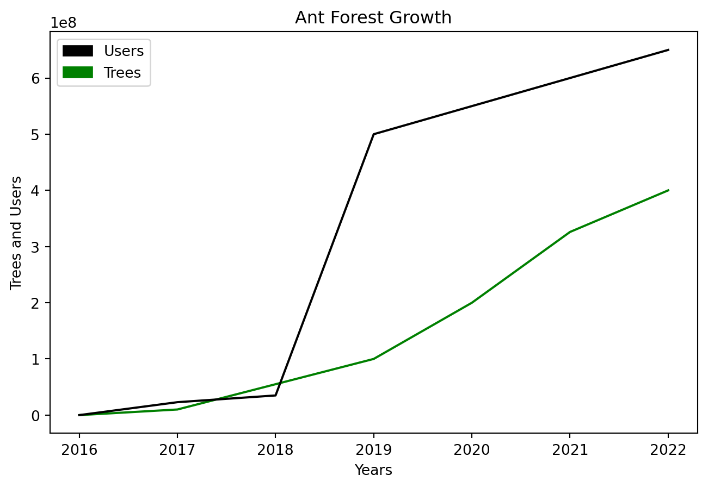

## Broken Mathplotlib {#broken-mathplotlib}

```python
# importing the modules
import numpy as np
import matplotlib.pyplot as plt
import matplotlib.patches as mpatches

# data to be plotted
x_years = [2016, 2017, 2018, 2019, 2020, 2021, 2022]
y_trees = [0, 10000000, 55000000, 100000000, 200000000, 326000000, 400000000]
y_users = [0, 23000000, 35000000, 500000000, 550000000, 600000000, 650000000]

# plotting
plt.title("Ant Forest Growth")
plt.xlabel("Years")
plt.ylabel("Trees and Users")
plt.plot(x_years, y_trees, color = "green")
plt.plot(x_years, y_users, color = "black")
plt.legend(handles=[mpatches.Patch(color='black', label='Users'), mpatches.Patch(color='green', label='Trees')])
plt.show()
```



